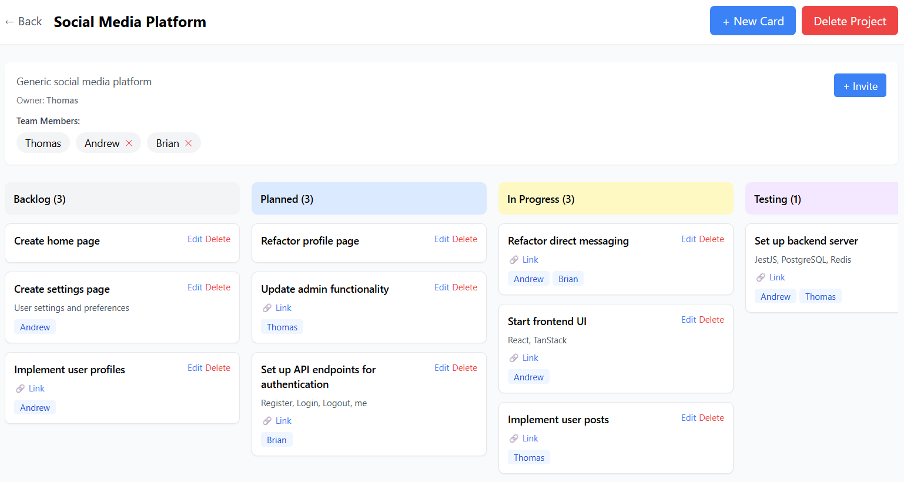

# NestJS & React Kanban Board

A NestJS backend with React frontend for real-time collaborative project management, featuring JWT authentication, WebSocket updates, and kanban-style task boards



---

## Features

- Real-time Collaboration – Live updates across all connected users via WebSockets
- Project Management – Create and manage multiple projects with team members
- Team Collaboration – Invite team members to projects and assign tasks
- Authentication – Secure user accounts with JWT-based authentication

---

## Technologies & Implementation

- Frontend - TypeScript React
- Backend - NestJS
- Database - PostgreSQL

---

## Local Development

## Running on Docker

1. Ensure Docker and Docker Compose are installed on your system
2. From the project root directory, start all services:
```
docker-compose up --build
```
3. Access the application:
    - Frontend: port 5173
    - Backend API: port 3001
    - PostgreSQL: port 5432

## Running locally

### Backend

1. Navigate to the backend directory:

```terminaloutput
cd backend
```

2. Create a `.env` file with the following variables:

```terminaloutput
DATABASE_URL
JWT_SECRET
FRONTEND_URL
```

3. Install dependencies:

```terminaloutput
npm install
```

4. Generate Prisma client:

```terminaloutput
npx prisma generate
```

5. Run migrations:

```terminaloutput
npx prisma migrate dev
```

6. Run backend:

```terminaloutput
npm run start:dev
```


### Frontend

**Local Setup**

1. Navigate to the frontend directory:

```terminaloutput
cd frontend
```

2. Create a `.env` file with the following variables:

```terminaloutput
VITE_API_URL
```

3. Install dependencies:

```terminaloutput
npm install
```

4. Run frontend:

```terminaloutput
npm run dev
```